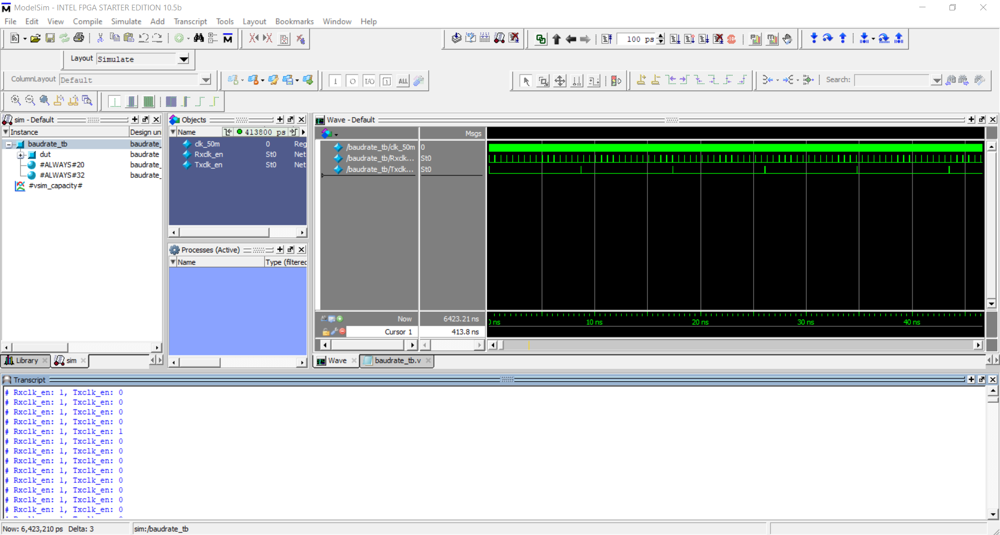
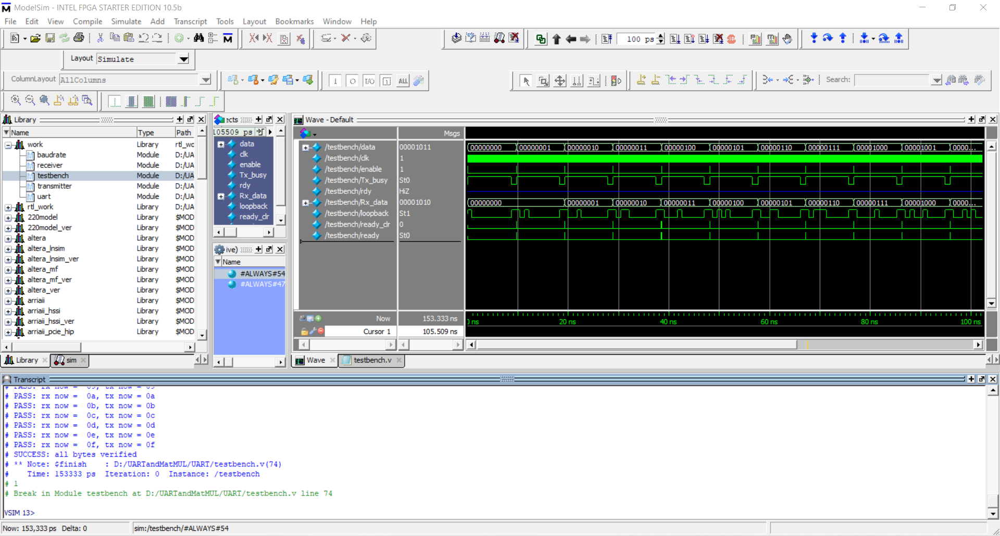
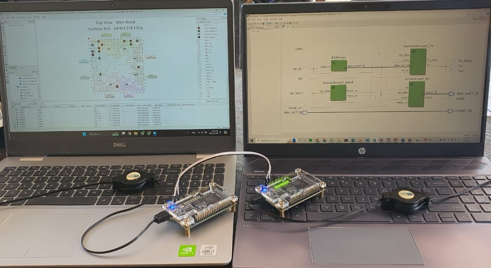
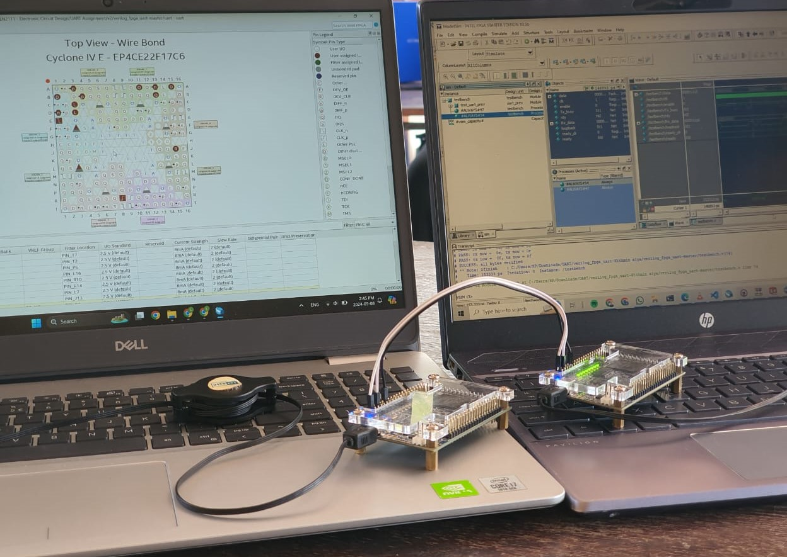

# Implementing UART Protocol on an FPGA, In Verilog

## Overview
This project demonstrates a UART (Universal Asynchronous Receiver Transmitter) transceiver implemented in Verilog and deployed on a Altera DE0 Nano FPGA board. The repository contains two versions of the UART implementation, each with a set of modules and testbenches.

## Repository Structure

### Version 1
- **baudrate.v**: Baudrate generator implemented. (Baudrate: 115200)
- **baudrate_tb.v**: Testbench for the baudrate generator.
- **receiver.v**: UART receiver implemented.
- **transmitter.v**: UART transmitter implemented.
- **transmitter_tb.v**: Testbench for the UART transmitter.
- **uart.v**: Complete UART implementation.
- **testbench.v**: Testbench for the entire UART system.

  
### Version 2
- **baudrate.v**: Baudrate generator implemented. (baudrate: 115200)
- **baudrate_tb.v**: Testbench for the baudrate generator.
- **receiver.v**: UART receiver implemented.
- **transmitter.v**: UART transmitter implemented.
- **ROM.v**: ROM module to load bytes for transmission.
- **uart.v**: Complete UART implementation.

## ROM Module Details - `ROM.v`
The ROM is structured with 32 8-bit registers, initialized with predefined values. The address is internally generated from 0 to 31, looping iteratively. Data is loaded on the negative edge of the `load_en` signal. For a given 5-bit address, when `load_en` is triggered (typically by pressing a switch), 8-bit data is loaded to the output.

## UART Transmitter - `transmitter.v`
The transmitter is designed to send data when `wr_en` is low and continues until `wr_en` goes high. To transmit data synchronized with the edges of `wr_en`, different methods were explored. The final implementation uses a **flag method** with two flags to detect the negative edge of `wr_en`. The transmitter is triggered on the positive edge of `wr_en`, allowing data to load from the ROM at the negative edge (button press) and transmit at the positive edge (button release). This state machine approach proved to be more reliable.

## Images
The following images provide visual insights into the project:

1. **Baudrate Test From Version 1 and 2**
   

2. **UART Test From Version 1**
   

3. **Implementation**
   
   
